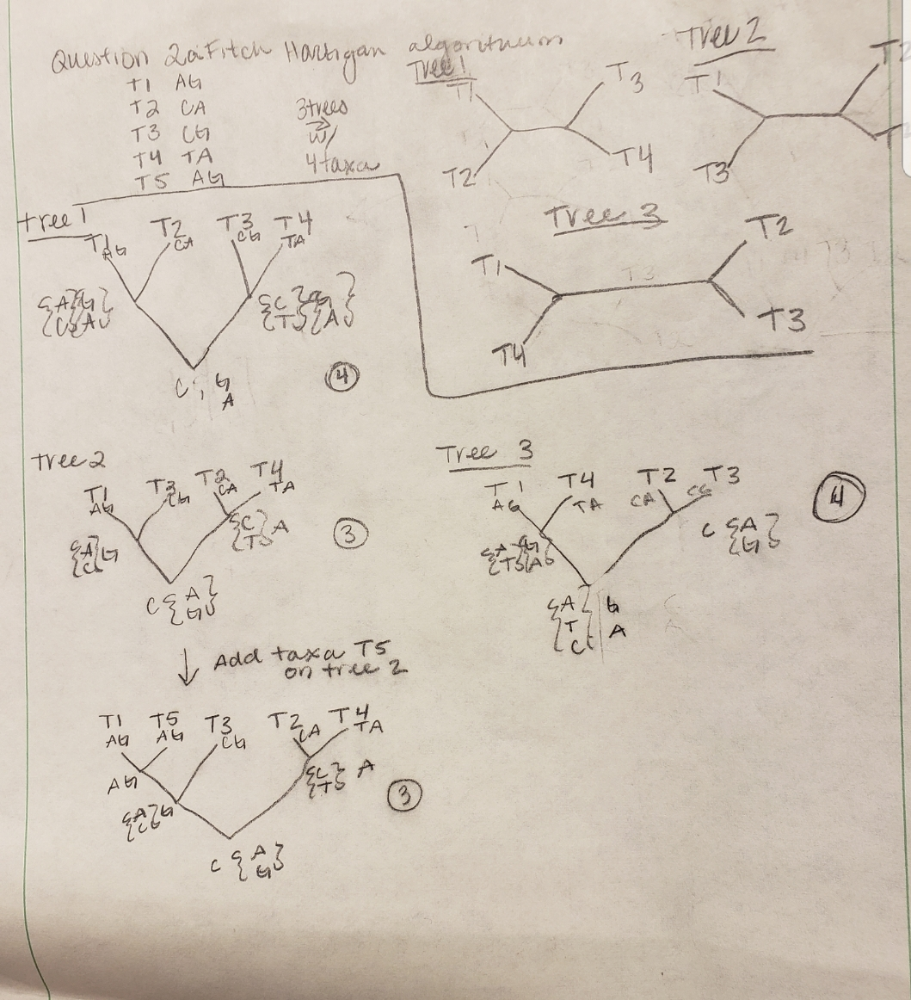
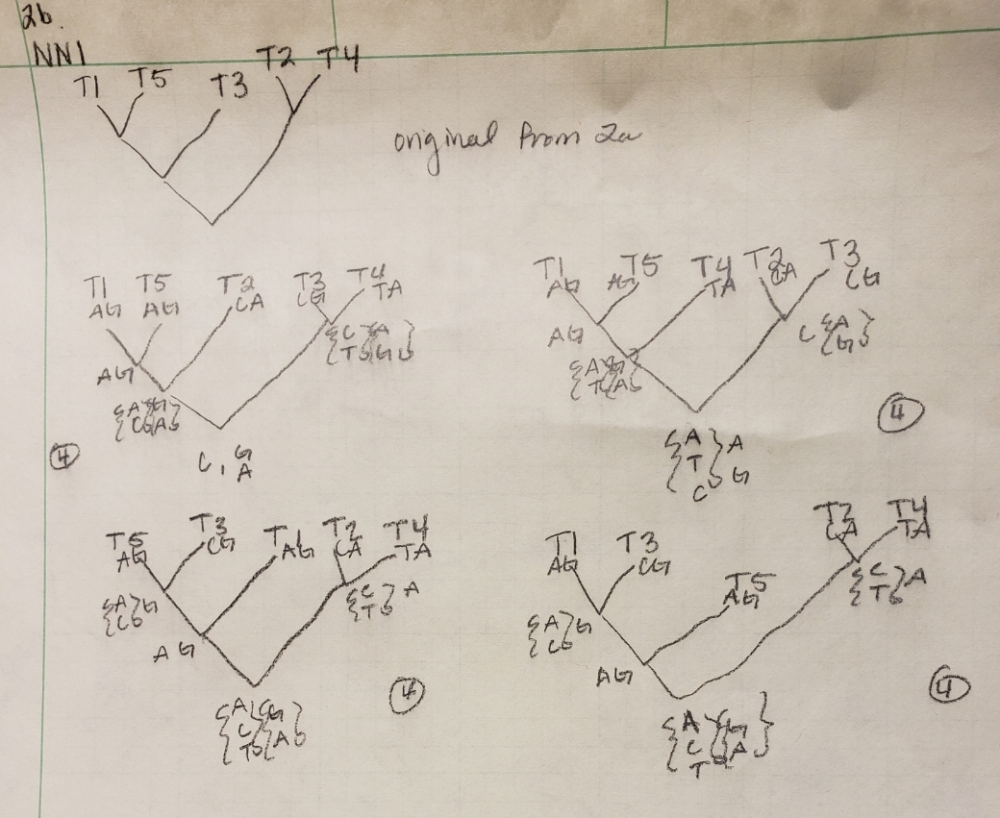
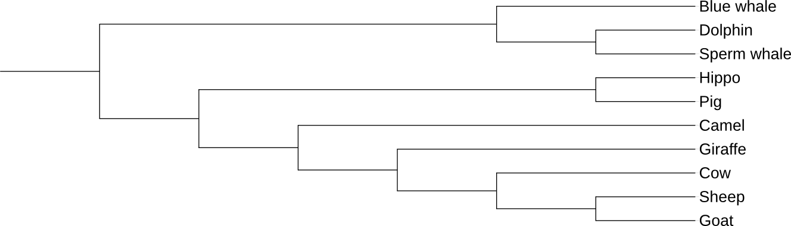
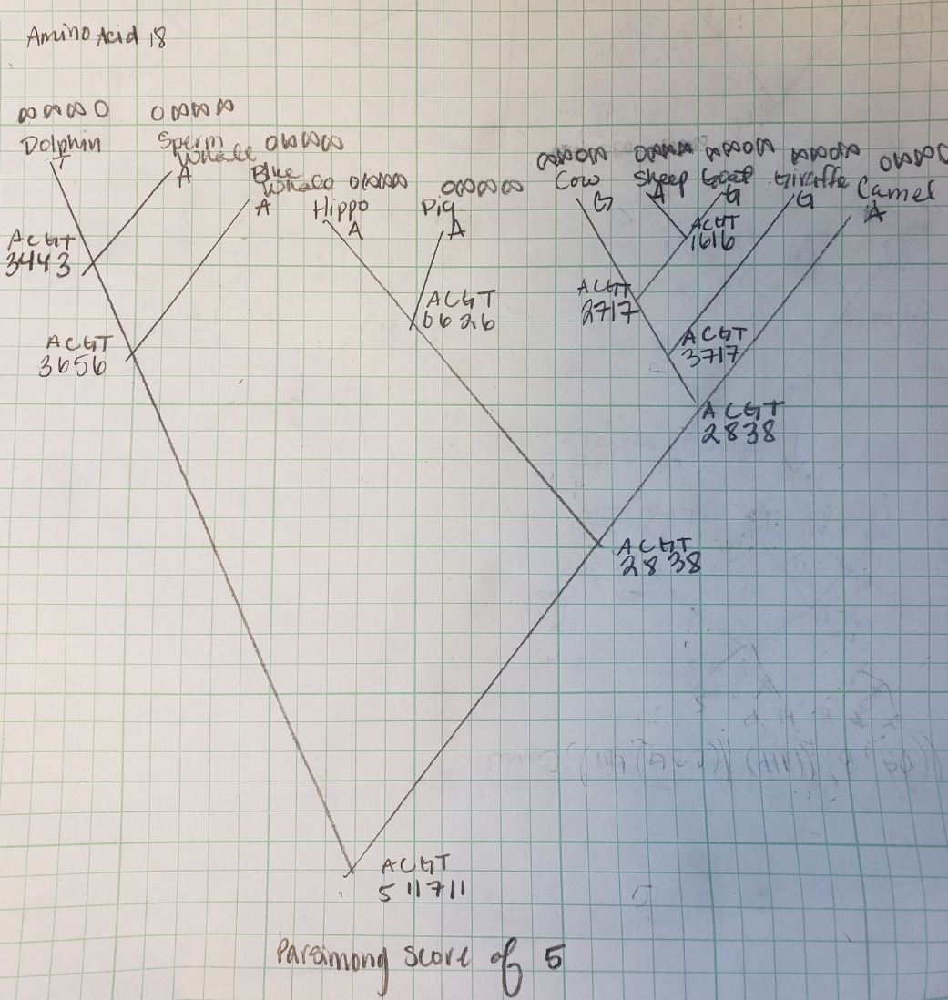
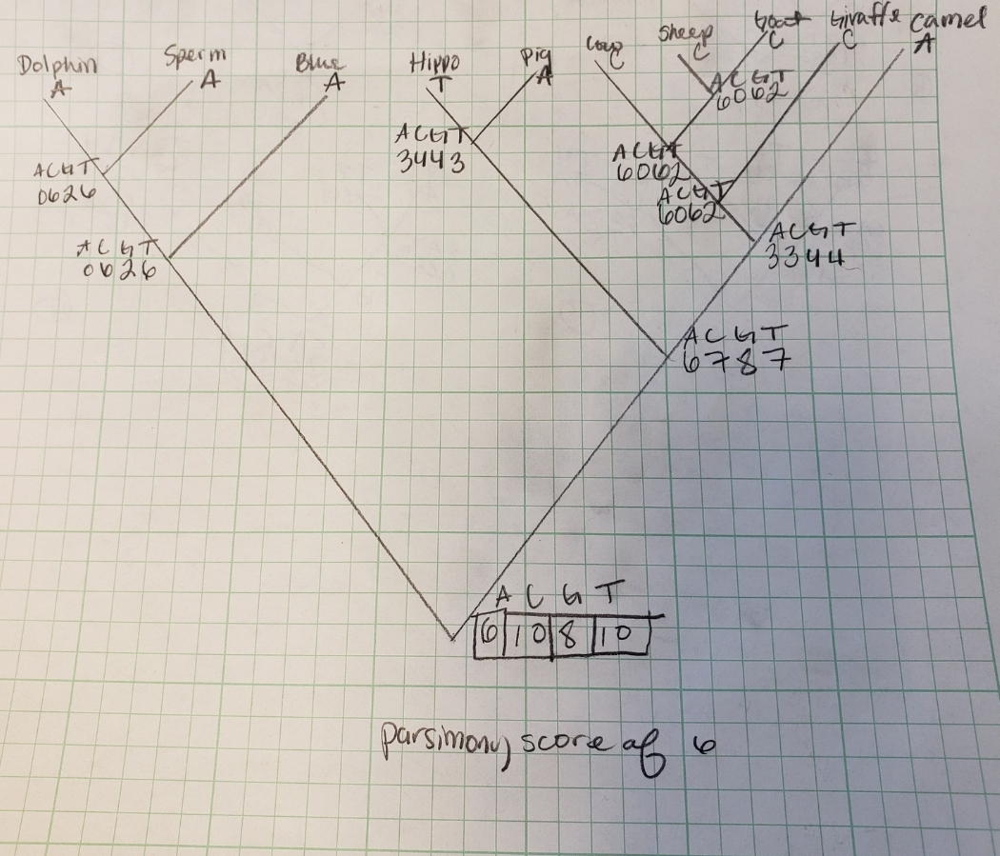
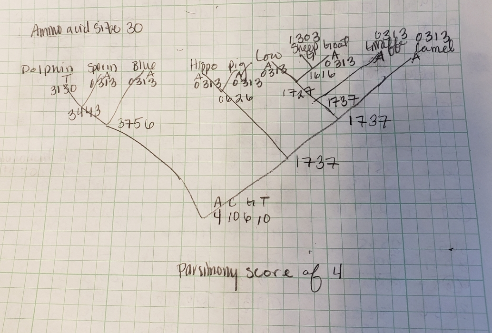

```{r setup, include=FALSE}
knitr::opts_chunk$set(echo = TRUE)

```

```{r include=FALSE}
library(Biostrings)
library(rlang)
```

##Assignment#2 Molecular Phylogeny
###Question 1:

To address question 1a: I will use the library Biostrings and read in the two sequences as amino acids then run a pairwise comparison of them with the subsitution Matric BLOSUM62 and and open gap penalty of 6 and a gap extension of 0.5. The penalties can be made larger to make the make the alignment more stringent or smaller to allow the alignment to be more flexible.
```{r}

######################################################################################
pattern <- c("ALIGNME")
subject <- c("AILMENT")
pattern <- unlist(AAStringSet(pattern))
subject <- unlist(AAStringSet(subject))
pattern  # original pattern
subject  # original subject
data(BLOSUM62)
pa5 <- pairwiseAlignment(pattern, subject,
                         substitutionMatrix=BLOSUM62,
                         gapOpening=6, gapExtension=0.5)
pa5
writePairwiseAlignments(pa5, Matrix="BLOSUM62")
#######################################################################################
```

As you can see, the alignment score is 4 and has an identity of 33.3% using a gap opening penalty of 6 and an extension penalty of 0.5. If we consider sequences that share less than 25% similarity to be random, then this sequence can in fact be considered homologous at 33.3% similiarity. 
 
 If we are to break appart how this is done, we first read in the sequences of interest and the subsutitution matrix of interest.
```{r}
data("BLOSUM62")
columns<-colnames(BLOSUM62)
rows<-rownames(BLOSUM62)

read_in_data<-function(string1){
  testing_seq<-c(string1)
  y<-testing_seq[1]
  sequence<-substring(y,seq(1,nchar(y),1),seq(1,nchar(y),1))
  return(sequence)
}

#sequence1<-read_in_data("GRQTAGL")
sequence1<-read_in_data("ALIGNME")

sequence1
#sequence2<-read_in_data("GTAYDL")
sequence2<-read_in_data("AILMENT")
sequence2

```

Then we can get the sequence indexes in that substitution matrix.
```{r}
get_index_in_BLOSUM62<-function(sequence){
  col_index_seq1=c("25")
  for (i in 1:length(sequence)){
    col_index_seq1[i+1] <- which(columns==sequence[i])
  }
  return(col_index_seq1)
}
col_index_seq1<-get_index_in_BLOSUM62(sequence1)
col_index_seq2<-get_index_in_BLOSUM62(sequence2)

```
Then to get the BLOSUM62 scoring matrix for this particular alignment would be...
```{r}
get_score_matrix_BLOSUM62<-function(index_vector_1,index_vector_2){
  counter=0
  alignment_1<-c()
  for (i in 1:length(index_vector_1)){
    for (j in 1:length(index_vector_2)){
      counter=counter+1
    #temp<-c(as.numeric(index_vector_1[i]),as.numeric(index_vector_2[j]))
    #print(temp)
      alignment_1[counter]<-BLOSUM62[as.numeric(index_vector_1[i]),as.numeric(index_vector_2[j])]
    }
  }
  alignment_matrix<-matrix(alignment_1,
                           nrow = length(col_index_seq2), 
                           ncol = length(col_index_seq1), 
                           byrow=FALSE,
                           dimnames = list(prepend(sequence2,"*",before=1),prepend(sequence1,"*",before=1)))
  return(alignment_matrix)
}
alignment_matrix<-get_score_matrix_BLOSUM62(col_index_seq1,col_index_seq2)
alignment_matrix

```
And then to get the scoring matrix would be ...
```{r}

blosum_alignment<-function(gap_penalty){
#sets the open gap penalty and the extension penalty
open_gap_penalty<-gap_penalty
counter=0
max_list<-c()
directions<-c()
for (i in 1:length(col_index_seq2)){
  for (j in 1:length(col_index_seq1)){
    counter=counter+1
    if ((i==1)&(j==1)){
      max_list[counter]<-alignment_matrix[i,j]
      directions[counter]<-"none"
    }
    else if ((i==1)& (j!=1)){
      penalty<-open_gap_penalty
      which_one<-c(max_list[(length(max_list))]+penalty)
      #print(which_one)
      max_list[counter]<-max(which_one)
      directions[counter]<-"Left"
    }
    else if ((i!=1)&(j==1)){
      penalty<-open_gap_penalty
      one_above<-max_list[(length(max_list)-((length(col_index_seq1))-1))]+penalty
      which_one<-c(one_above)
      #print(which_one)
      max_list[counter]<-max(which_one)
      directions[counter]<-"Above"
    }
    else {
      penalty<-open_gap_penalty
      diagonal_before=max_list[(length(max_list))-(length(col_index_seq1))]
      current_score=alignment_matrix[i,j]
      one_to_left<-max_list[(length(max_list))]+penalty
      one_above<-max_list[(length(max_list)-((length(col_index_seq1))-1))]+penalty
      which_one<-c((diagonal_before+current_score),one_above,one_to_left)
      #print(duplicated(which_one))
      max_list[counter]<-max(which_one)
      #print(which_one)
      duplicated_vector<-duplicated(which_one)
      #print((duplicated_vector))
      if (TRUE %in% duplicated_vector){
        #directions[counter]="combo"
        two_directions<-which(which_one==which_one[which(duplicated_vector)])
        #print(which(which_one==which_one[which(duplicated_vector)]))
        if ((two_directions[1]==1)&(two_directions[2]==2)){
          #print("Diag/Above")
          directions[counter]<-"D/A"
        }
        if ((two_directions[1]==1)&(two_directions[2]==3)){
          #print("Diag/Left")
          directions[counter]<-"D/L"
        }
        if ((two_directions[1]==2)&(two_directions[2]==3)){
          #print("Above/Left")
          directions[counter]<-"A/L"
        }
      }
      else {
      if (max(which_one)==(diagonal_before+current_score)){
        #print("Diagonal")
        directions[counter]<-"Diag"
      }
      else if (max(which_one)==one_above){
        #print("Above")
        directions[counter]<-"Above"
      }
      else if (max(which_one)==one_to_left){
        #print("Left")
        directions[counter]<-"Left"
      }
      }
    }
  }
}

print(matrix(directions,nrow = length(col_index_seq2),
             ncol=length(col_index_seq1),
             byrow = TRUE,
             dimnames = list(prepend(sequence2,"*",before=1),prepend(sequence1,"*",before=1))))
return(matrix(max_list, 
              nrow = length(col_index_seq2),
              ncol=length(col_index_seq1),
              byrow=TRUE,
              dimnames = list(prepend(sequence2,"*",before=1),prepend(sequence1,"*",before=1))))
}
scoring_matrix<-blosum_alignment(-4)
scoring_matrix
```
If we were to perform a local alignment we would find the largest number in the matrix which would be 11 and then follow the traceback of that alignment resulting in the alignment looking like this:

Local Alignment:

*ALIGNME-- \newline
*AIL--MENT \newline

Now for a global alignment, we would start in the lowest row, at the far right corner to start out traceback. In this case there are two different alignments that are possible.

Global Alignment 1:

*A-LIGNME \newline
*AILMEN-T \newline

Global Alignment 2:

*A-LIGNME \newline
*AILMENT- \newline

1b. As seen above, the sequences to share an identity of 33.3% which is high enough to be considered homologous. 

As to if BLOSUM62 is the best alignment that can be used in this case, there are many more options. BLOSUM62 is a substitution matrix designed with sequences that share 62% identity and therefore works best on sequences that are less than 62% idenical, which our sequences are. As the sequence aligns with 33% idenity, it may be worth while to consider using BLOSUM45 which is used for divergent proteins. 
When we perform the analysis with BLOSUM45,however, we have a parsimony score of 7 meaning that there would have to be more changes to the sequence to explain the difference than the there alignment. 
```{r}
data(BLOSUM45)
pa5 <- pairwiseAlignment(pattern, subject,
                         substitutionMatrix=BLOSUM45,
                         gapOpening=6, gapExtension=0.5)
pa5
writePairwiseAlignments(pa5, Matrix="BLOSUM45")
```
There are many other alignments that can be done using maximum likelihood, bayesian estimatimations, etc. As we saw above as well, we can also perform a local alignment or a global alignment and there can even be muliple global alignments to chose from.

###Question 2:
2a. Three trees with four taxa are drawn and then the tree with the smallest parsimony score is selected. The fifth taxa is added to the selected tree. The best tree generated with five taxa was the build using tree 2 and gives us a parsimony score of 3.
```{r fitch_hartigan_algoithum, echo=FALSE, fig.cap="Fitch Hartigan algoithum figure 2a", out.width = '100%'}

```
2b. To ensure that the best tree is selected, the tree undergoes nearest neighbor interchange (NNI) and the parsimony score of each is calculated for each tree. As it turns out, all other trees result in a parsimony score of 4 while the original tree from 2a has a parsimony score of 3.
```{r NNI, echo=FALSE, fig.cap="NNI (question 2b)", out.width = '100%'}

```

2c. The best tree that Was created was the original tree drawn in 2a with a parsimony score of 3. All other trees generated using NNI gave me a parsimony score of 4.

###Question 3:
3a.For a site to be parsimoniously informative that site will have at least two different character states at least in two different taxa. In this examoke it is at amino acid sites 18, 21 anad 30. 

```{r given_tree, echo=TRUE, fig.cap="3a given tree", out.width = '100%'}

```


3b. The Sankoff algorithum on site amino acid 18 gives us a parsimony score of 5.
```{r sankoff_site_18, echo=FALSE, fig.cap="Sankoff algorithum on site amino acid 18", out.width = '100%'}

```


 The Sankoff algorithum on site amino acid 21 gives us a parsimony score of 6.
```{r sankoff_site_21, echo=FALSE, fig.cap="Sankoff algorithum on site amino acid 21", out.width = '100%'}

```


The Sankoff algorithum on site amino acid 30 gives us a parsimony score of 4.
```{r out.width = "100%",sankoff_site_30, echo=FALSE, fig.cap="Sankoff algorithum on site amino acid 30"}

```
##Question #4:
To read in my data I copied it from our class github page and then loaded the module mafft to align the nucleotide sequence.
```{}
module load mafft
mafft --nuc cob_nt.fasta > cob_nt_alignment.aln
```
Then the alignment can be read into paup and convert the file to a nexus file and load the file into the program. WE can also set an outgroup in order to root the tree.
```{}
paup;
ToNexus format=FASTA fromFile= cob_nt_alignment.aln  toFile=cob_nt_nexus.nxs datatype=nucleotide;
exe cob_nt_nexus.nxs;
tstatus full;
outgroup 1-2;

```
To perform the heuristic searches in paup we use the command hsearch and specify which swapping method to use. 
```{}
hsearch swap=none;
showtree;
showtrees all;
describe /plot=phylo;
savetrees file=hsearch_none.tre brlens;
hsearch swap=NNI;
showtrees all;
describe /plot=phylo;
savetrees file=hsearch_NNI.tre brlens;
hsearch swap=SPR;
showtrees all;
describe /plot=phylo
savetrees file=hsearch_SPR.tre brlens;
hsearch swap=TBR;
showtrees all;
describe /plot=phylo;
savetrees file=hsearch_TBR.tre brlens;

hsearch start=stepwise addseq=random nreps=100 swap=TBR;
showtrees all;
describe /plot=phylo
savetrees file=hsearch_TBR_100reps.tre brlens;
contree;
contree /strict=no majRule=yes usetreewts=no treeFile=hsearch_TBR_consensus_majority.tre saveSupport=Both
contree /strict=yes majRule=no usetreewts=no treeFile=hsearch_TBR_consensus_strict.tre saveSupport=Both

```

We can read these files into R to compare them visually using the ape package:
```{r}
library("ape")
```
I put these files onto my local machine using scp:
```{}
scp demolnau@hpc-class.its.iastate.edu:/home/demolnau/EEOB563-Spring2019/homework/assignment3/* .

```

Now we can read in the files using the command read.nexus():
```{r}
none_swap<-read.nexus("hsearch_none.tre",tree.names = "No_swapping", force.multi = FALSE)
NNI<-read.nexus("hsearch_NNI.tre", tree.names = "NNI", force.multi = TRUE)
SPR<-read.nexus("hsearch_SPR.tre",tree.names = "SPR",force.multi = FALSE)
TBR<-read.nexus("hsearch_TBR.tre",tree.names = "TBR",force.multi = FALSE)
TBR_rep<-read.nexus("hsearch_TBR_100reps.tre", tree.names = "TBR_reps",force.multi = TRUE)
TBR_consusus_maj<-read.nexus("hsearch_TBR_consensus_majority.tre",
                             tree.names = "TBR_consensus_majority",force.multi = FALSE)
TBR_consusus_strict<-read.nexus("hsearch_TBR_consensus_strict.tre",
                                tree.names = "TBR_consensus_strict",force.multi = FALSE)
```
To visualize the trees we will use ggplot and ggtree.
```{r}
library("ggplot2")
library("ggtree")
library("gridExtra")
none_vis<-ggtree(none_swap)+ geom_text2(aes(subset=!isTip, label=node), hjust=-.3) + 
  geom_tiplab()+
  labs(title="No Swapping")
none_vis
```
Looking at the two NNI trees:
```{r}
NNI1_vis<-ggtree(NNI[1])+ 
  geom_text2(aes(subset=!isTip, label=node), hjust=-.3, size=3) + 
  geom_tiplab(size=3)+
  labs(title="NNI tree1")+
  theme(plot.title = element_text(size = 10))
NNI2_vis<-ggtree(NNI[2])+ 
  geom_text2(aes(subset=!isTip, label=node), hjust=-.3,size=3) + 
  geom_tiplab(size=3)+labs(title="NNI tree2")+
  theme(plot.title = element_text(size = 10))

grid.arrange(NNI1_vis, NNI2_vis, nrow = 1)
```
To look at the SPR tree:
```{r}
SPR_vis<-ggtree(SPR)+ 
  geom_text2(aes(subset=!isTip, label=node), hjust=-.3, size=3) + 
  geom_tiplab(size=3)+
  labs(title="SPR")+
  theme(plot.title = element_text(size = 10))
SPR_vis
```
To look at the TBR tree and the TBR tree with 100 replicates , as well as their consensus trees:
```{r}
TBR_vis<- ggtree(TBR)+ 
  geom_text2(aes(subset=!isTip, label=node), hjust=-.3, size=3) + 
  geom_tiplab(size=3)+
  labs(title="TBR no replicates")+
  theme(plot.title = element_text(size = 10))
TBR_rep_1_vis<-ggtree(TBR_rep[1])+ 
  geom_text2(aes(subset=!isTip, label=node), hjust=-.3,size=3) + 
  geom_tiplab(size=3)+
  labs(title="TBR with 100 replicates tree1")+
  theme(plot.title = element_text(size = 10))
TBR_rep_2_vis<-ggtree(TBR_rep[2])+ 
  geom_text2(aes(subset=!isTip, label=node), hjust=-.3,size=3) +
  geom_tiplab(size=3) +
  labs(title="TBR with 100 replicates tree2")+
  theme(plot.title = element_text(size = 10))
TBR_rep_3_vis<-ggtree(TBR_rep[3])+ 
  geom_text2(aes(subset=!isTip, label=node), hjust=-.3,size=3) +
  geom_tiplab(size=3)+
  labs(title="TBR with 100 replicates tree3")+
  theme(plot.title = element_text(size = 10))
TBR_con_maj_vis<-ggtree(TBR_consusus_maj)+ 
  geom_text2(aes(subset=!isTip, label=node), hjust=-.3,size=3) +
  geom_tiplab(size=3)+
  labs(title="TBR Consensus tree by Majority")+
  theme(plot.title = element_text(size = 10))
TBR_con_str_vis<-ggtree(TBR_consusus_strict)+ 
  geom_text2(aes(subset=!isTip, label=node), hjust=-.3,size=3) +
  geom_tiplab(size=3)+
  labs(title="TBR Consensus tree strict")+
  theme(plot.title = element_text(size = 10))

TBR_vis
grid.arrange(TBR_con_maj_vis,TBR_con_str_vis, nrow=1)
grid.arrange( TBR_rep_1_vis, TBR_rep_2_vis, TBR_rep_3_vis, nrow = 1)
#multiplot(TBR_rep_1_vis, TBR_rep_2_vis, ncol=2)

```

If we are to compare the various methods of swapping, it is obvious right away that the methods result in different numbers of trees. When we have no swapping occuring, use SPR, or TBR (with no replicates) there is only one tree generated. IF we use NNI (nearest neighbor interchange) we will get two possible trees, however. After running 100 replicates of TBR, there are three possible trees that are generated. The topology of the tree also changes when we switch methods. This is noteable if we focus on where elephant is in the tree. In the tree where there is no swapping or when we are using the NNI method, we see that eleplant groups with aadvark and rabbit. When we switch to using SPR and TBR, however we see elephant is supposely most closely related to sloth. Lastly, the branch lengths are also fluctuating with changes of methods. 
##Question #5:
200 replicate bootstrap with 10 random additions TBR replicates per replicate.
```{}
paup;
exe cob_nt_nexus.nxs;
tstatus full;
outgroup 1-2;
set outroot=mono;
bootstrap nreps=200 treefile=boot.tre search=heuristic /start=stepwise addseq=random nreps=10 swap=TBR;
savetrees file=bootMajRule.tree from=1 to=1 savebootp=nodelabels;
gettrees file=boot.tre StoreTreeWts=yes mode=3;
# majority rule consensus tree and save this tree
contree all/strict=no majrule=yes usetreewts=yes treefile=bootMajRule.tre saveSupport=Both;
contree all/strict=yes majrule=no usetreewts=yes treefile=bootMajRule.tre saveSupport=Both;
quit;

```

To visualize the tree, we can use the same methods from before:
```{r}
boot_con_maj<-read.nexus("bootMajRule.tre",
                         tree.names = "TBR_consensus_Majority_with_bootstraps",
                         force.multi = FALSE)
boot_con_strict<-read.nexus("boot_strict.tre",
                            tree.names = "TBR_consensus_Strict_with_bootstraps",
                            force.multi = FALSE)
boot_con_maj_vis<-ggtree(boot_con_maj)+ 
  geom_text2(aes(subset=!isTip, label=node), hjust=-.3,size=3) +
  geom_tiplab(size=3)+
  labs(title="TBR Consensus tree by Majority with Bootstraps")+
  theme(plot.title = element_text(size = 10))
boot_con_strict_vis<-ggtree(boot_con_strict)+ 
  geom_text2(aes(subset=!isTip, label=node), hjust=-.3,size=3) +
  geom_tiplab(size=3)+
  labs(title="TBR Consensus tree Strict with Bootstraps")+
  theme(plot.title = element_text(size = 10))
grid.arrange(boot_con_strict_vis, boot_con_maj_vis,nrow = 1)


```
It is quite obvious when visualizing the consensus trees that the method for picking the consensus trees greatly affects the trees' topology and branch lengths. When something is different in a tree, the strict method will instantly given them the same length, which means that we are loosing information, while the majority rule sees how may times it sees that topology and choses the majority. In the case of using 200 replicates, the strict method allows us 200 opportunities for our trees to disagree with each other so then it will simply say nothing is certain while the majority method benefits from the 200 replicates and uses that to confidently decide on which taxa belong together.
