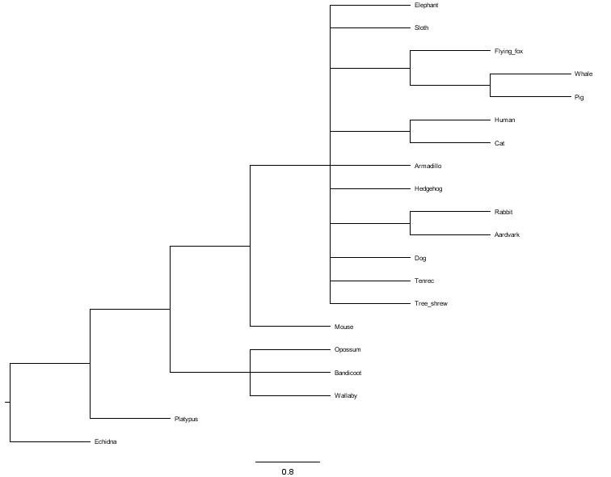
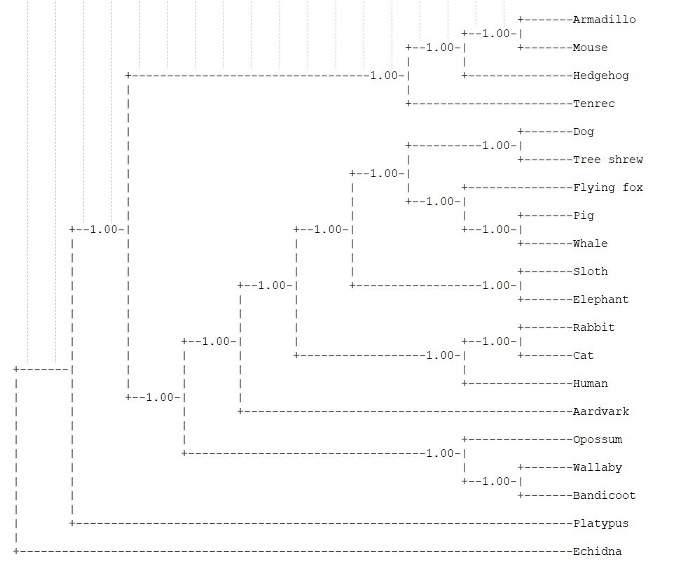

```{r setup, include=FALSE}
knitr::opts_chunk$set(echo = TRUE)

```
```{r include= FALSE}
library(Biostrings)
library(ape)
library(phangorn)
library(rlang)
setwd("D:/Documents/BoxSync/Classes/EEOB563_lab/labs/assignment_4")
```

#EEOB563 assignment 4
##Question 1:
To get a Jukes Cantor distance matrix we can read in the data as sequences. We can use the library ape and the function dist.dna() to get the JC matrix. 
```{r}
sequences<-read.FASTA("sequences_1a.txt", type="DNA")
dist.dna(sequences,model="JC69")
```
To calulate the distances manually you will need to count the number of distances between every pair of sequences and then from that you can calculate the distances. 
```{r}
seq1a<-read.dna("sequences_1a.txt", format = "fasta", as.character = TRUE, as.matrix = TRUE)
comparing<-function(string1, string2){
  counter=0
  for (i in 1:length(sequences[[1]])){
    if (string1[i]!=string2[i]){
      counter=counter+1
    }
  }
  return(counter)
}

get_distances<-function(matrix_of_interest){
  l<-length(row.names(matrix_of_interest))
  a<-matrix(data=NA,nrow=length(row.names(matrix_of_interest)),
            ncol=length(row.names(matrix_of_interest)),
            dimnames = list(row.names(matrix_of_interest),
                            row.names(matrix_of_interest)))
  for (i in 1:l){
    for (j in 1:l){
    value<-comparing(matrix_of_interest[i,],matrix_of_interest[j,])
    a[i,j]<-value
    a[j,i]<-value
    }
  }
  return(a)
  }
a<-get_distances(seq1a)

cat("Differences in amino acid sequences Question#1")
cat("\n")
a #Differences in amino acid sequences Question#1
a_prob<-a/(length(seq1a[1,]))
#a_prob<-formatC(a_prob, digits = 5, format = "f")
distance_matrix<-(-3/4)*log(1-((4/3)*(a_prob)))
cat("------------------------------------------\n")
cat("Distance matrix Question#1")
cat("\n")
distance_matrix #Distance matrix Question#1
```
```{r question1, echo=FALSE, fig.cap="Distance Matrix Question#1", out.width = '100%'}
#knitr::include_graphics("assignment4_question1_image.jpg")
```
##Question 2:
Using this distance matrix we can build the UPGMA tree. 
```{r}

tree_upgma<-upgma(D=distance_matrix)
plot(tree_upgma, type="phylogram", use.edge.length = TRUE, show.tip.label = TRUE, show.node.label = TRUE)
edgelabels(formatC(tree_upgma$edge.length, digits = 4, format = "f"), bg="black", col="white", font=0.2)
#tree_upgma$edge.length

```

To do this by hand you would combine the columns with the smallest distance together and then recalculate the distances after that each time. Work attached to end of document.

```{r question2, echo=FALSE, fig.cap="UPGMA tree building Question#2", out.width = '100%'}
#knitr::include_graphics("assignment4_question2_image.jpg")
```

##Question 3:
To create a neighbor joining tree we will take the distance matrix tree from question 1. We will average the row values and then generate a new matrix of the intersect of the cell-the row average- the row average for the other intersected taxa. Using the minimum of this new matrix (called U) we will new which two taxa are the nearest neighbor of one another. We will then recalculate the distance between our grouped taxa and the other taxa and restart the process again.
```{r}
#length(distance_matrix[1,])
average_dist_matrix<-function(dist_mat){
  average_dist<-c()
  for (i in 1:length(dist_mat[1,])){
    average_dist[i]<-sum(dist_mat[i,])/((length(dist_mat[1,]))-2)
  }
  #average_dist
  dist_mat_alter<-cbind(dist_mat,average_dist)
  return(dist_mat_alter)
}

dist_mat_alter<-average_dist_matrix(distance_matrix)
cat("------------------------------------------\n")

dist_mat_alter #The new distance matrix with the row averages added
cat("------------------------------------------\n")
u_matrix<-function(dist_mat){
  new_dim_names<-unlist(list(row.names(dist_mat)))
  #new_dim_names<-unlist(list(row.names(dist_mat_alter)))
  dimension<-length(dist_mat[,1])
  #dimension<-length(dist_mat_alter[,1])
  which_next<-matrix(NA,nrow=dimension,ncol = dimension,
       dimnames = list(new_dim_names,new_dim_names))
which_next
for (i in 1:length(which_next[1,])){
  for (j in 1:length(which_next[1,])){
    if (i==j){
      which_next[i,j]<-0
    }
    else{
      value<-dist_mat[i,j]-
        dist_mat[i,length(dist_mat[1,])]-
        dist_mat[j,length(dist_mat[1,])]
      which_next[i,j]<-value
    }
  }
}
return(which_next)
}

u_matrix(dist_mat_alter) #This return the matrix to tell you which branch to cluster next
```
Because the smallest element of the u matrix is the intersection between Cat and Pig, those taxa will be the first to merge. I create a new distance matrix with of those two columns merged and then start the process again.

NJ distance matrix with four taxa groups now.
```{r}
new_dim_names<-list("Dog","Pig/Cat","Mouse","Human")
nj_matrix_1<-matrix(data = c(0,0.0735,0.147,0.329,0.0735,0,0.1365,0.3295,0.147,0.1365,0,0.383,0.329,0.3295,0.383,0),
                    nrow = 4, ncol = 4, dimnames = list(new_dim_names,new_dim_names))
cat("NJ distance matrix with 4 taxa\n")
nj_matrix_1 #NJ distance matrix with 4 taxa
aver_nj_mat_1<-average_dist_matrix(nj_matrix_1)
cat("------------------------------------------\n")
cat("Altered distance 4 taxa matrix with row averages\n")
aver_nj_mat_1 #Altered distance 4 taxa matrix with row averages
cat("------------------------------------------\n")
cat("U matrix of 4 taxa distance matrix\n")
u_matrix(aver_nj_mat_1) # U matrix of 4 taxa distance matrix

branch_length_nj<-function(mat,i,j){
  value<-((1/2)*(mat[i,j]))+((1/2)*(aver_nj_mat_1[i,length(aver_nj_mat_1[1,])]-aver_nj_mat_1[j,length(aver_nj_mat_1[1,])]))
  return(value)
}
#branch_length_nj(aver_nj_mat_1,2,1)
#branch_length_nj(aver_nj_mat_1,1,2)
#branch_length_nj(aver_nj_mat_1,3,4)
#branch_length_nj(aver_nj_mat_1,4,3)
```
Next JC distance matrix  with 3 taxa groups now.
```{r}
new_dim_names<-list("Dog","Pig/Cat","Mouse/Human")
nj_matrix_2<-matrix(data = c(0,0.0735,0.044,0.0735,0,0.04175,0.044,0.04175,0),
                    nrow = 3, ncol = 3, dimnames = list(new_dim_names,new_dim_names))
cat("NJ distance matrix with 3 taxa groups\n")
nj_matrix_2 #NJ distance matrix with 3 taxa groups
cat("------------------------------------------\n")
aver_nj_mat_2<-average_dist_matrix(nj_matrix_2)
cat("NJ distance matrix with 3 taxa groups and row averages\n")
aver_nj_mat_2 #NJ distance matrix with 3 taxa groups and row averages
cat("------------------------------------------\n")
u_matrix(aver_nj_mat_2)

#branch_length_nj(nj_matrix_2,1,2) #distance between dog and the internal node pig/cat
#branch_length_nj(nj_matrix_2,2,1) #distance between pig/cat internal node and dog

```
To get the absolute last matrix, there is no difference is merging dog with cat and pig or merging dog with human and mouse. I am chosing to merge dog with cat and pig.
```{r}
new_dim_names<-list("Dog/Pig/Cat","Mouse/Human")
nj_matrix_3<-matrix(data = c(0,0.006125, 0.006125,0),
                    nrow = 2, ncol = 2, dimnames = list(new_dim_names,new_dim_names))
nj_matrix_3

```

To verify our results, we can build the NJ tree using the ape package's NJ() function.
```{r}
neighbor_joining_tree<-NJ(distance_matrix)
plot(neighbor_joining_tree,type="phylogram")
edgelabels(formatC(neighbor_joining_tree$edge.length, digits = 4, format = "f"), bg="black", col="white", font=1)

```
##Question 4:
The rest of this assignment is done in the commandline on an hpc.The multiple sequence alignment is first generated using MAFFT and saved in a phylip format. Then we load in phylip and generate a distance matrix.Using the program dnadist within phylip, we can create several different distance matrices: Jukes-Cantor, Kimura, Log and F84.With these distance matrices we can create a neighbor joining tree of both and then create a strict consensus tree using consense.

```{}
module load mafft
mafft --nuc --phylipout cob_nt.fasta > cob_nt_aln.phylip
module load  phylip
dnadist cob_nt_aln.phylip 
neighbor
consense #strict, root 
```

```{r consensus tree, echo=FALSE, fig.cap="Consensus tree (question 4)", out.width = '100%'}

```
##Question 5:
Majority consensus tree
```{r majority tree, echo=FALSE, fig.cap="Majority tree (question 5)", out.width = '100%'}

```

