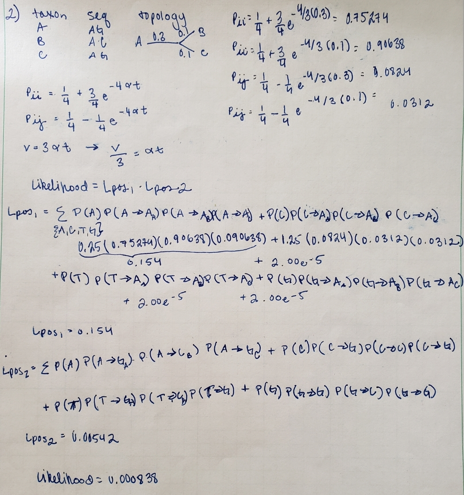

```{r setup, include=FALSE}
knitr::opts_chunk$set(echo = TRUE)

setwd("D:/Documents/BoxSync/Classes/EEOB563_lab/labs/assignment_5")
library(Biostrings)
library(ape)
library(phangorn)
library(rlang)
library(phytools)
library(ggtree)
library(ggplot2)
library(gridExtra)

```


# Assignment 5 - EEOB563- Spring 2019

## PART1

### Question 1: 

<center>
{ width=75% }
</center>

Question 1 comes from Exercise 4 from the Phylogeny textbook.

<center>
{ width=75% }
</center>
**1a.** The second sequence (right) described in the frequency table 6.2 as $S_{0}'/ S_1'$ is approprite for the Jukes-Cantor Model because the frequencies of the nucleotides changing are equal. When you look at the frequency table for $S_0$ / $S_1$ (left), there is a noticable jump in the conversion of A $\rightarrow$ G and $G \rightarrow A$ compared to the other nucleotides. 

**1b.** The models F81 and GTR, allow for a change in nucleotide frequencies, which would be best options for the first sequence $S_0$ / $S_1$ (left). 


### Question 2:

To find the likelihood of the given tree according to the JC model we find the the likelihood of each position being in one particular state and then multiply those together to get an overall likelihood.So we will break the overall likelihood into the likelihood of position 1 and mulitply that by the likelihood of position 2. 
The likelihood of a position is the sum of all possible outcomes. 
```{r}
a<-(1/4)+((3/4)*(exp((-4/3)*0.3)))
b<-(1/4)+((3/4)*(exp((-4/3)*0.1)))
c<-(1/4)-((1/4)*(exp((-4/3)*0.3)))
d<-(1/4)-((1/4)*(exp((-4/3)*0.1)))
aa<-0.25*a*b*b
ca<-0.25*c*d*d
ta<-0.25*c*d*d
ga<-0.25*c*d*d
loc1<-aa+ta+ca+ga

temp1<-0.25*c*d*d
temp2<-0.025*c*b*d
temp3<-0.25*c*d*d
temp4<-0.25*a*d*b
loc2<-temp1+temp2+temp3+temp4
loc1*loc2
```

<center>
{ width=100% }
</center>


## PART 2

### Question 3:
Fastme estimates phylogenies using distance methods from nucleotide or amino acid multiple sequences alignments.Both RAxML trees were run with a slurm script for the sake of moving the script off the head node. The number of threads used were reduced as there was an error being thrown into regards of them being excessive and this would stop the program from running. 

```{}

screen -S raxml

raxml-ng --all --msa data/alignment.fs --model GTR+G --prefix bootstrap --seed 2 --threads 16 --bs-metric fbp --bs-trees 200

raxml-ng --all --msa data/alignment.fs --model F81 --prefix F81_bootstrap --seed 2 --threads 6 --bs-metric fbp --bs-trees 200

module load fastme
fastme --help
#fastme  [-i input data file]  [-u input user tree file]
#        [-o output tree file]  [-O output matrix file]  [-I output information file]
#        [-B output bootstrap trees file]  [-a]
#        [-m method]  [ -D[model] | -P[model] ]  [-r]  [-e]  [-g[alpha]]  [-n[NNI]]  [-s]  [-w branch]
#        [-d datasets]  [-b replicates]  [-z seed]
#        [-c]
#        [-f]  [-T number of threads]  [-v]  [-V]  [-h]

fastme -i data/alignment.phy -o fasta_fastme.tre -d F81

```
The trees are visualized as:
```{r}
fastme_tree<-read.newick("fasta_fastme.tre")
#fastme_tree$tip.label
species_fastme<-c("Tree_shrew", "Wallaby", "Opossum", "Bandicoot", "Platypus", "Echidna", "Tenrec", "Hedgehog","Elephant","Mouse","Aardvar", "Rabbit", "Dog","Cat","Human", "Flying_fox","Sloth", "Armadillo", "Pig", "Whale")
fastme_tree_outgroup<-c(which(fastme_tree$tip.label=="MM_Platypu"), which(fastme_tree$tip.label=="MM_Echidna")) 
#fastme_tree_outgroup
fastme_tree<-root.phylo(fastme_tree, fastme_tree_outgroup, resolve.root = TRUE)
#is.rooted(fastme_tree)
fastme_tree$tip.label<-species_fastme

GTR_G_tree<-read.newick("bootstrap.raxml.support")
#GTR_G_tree$tip.label
GTR_G_tree_outgroup<-c(which(GTR_G_tree$tip.label=="MM_Platypus.mf"), which(GTR_G_tree$tip.label=="MM_Echidna.mf")) 
#GTR_G_tree_outgroup
GTR_G_tree<-root.phylo(GTR_G_tree, GTR_G_tree_outgroup, resolve.root = TRUE)
#is.rooted(GTR_G_tree)
GTR_G_tree$tip.label<-c("Mouse","Hedgehog","Elephant","Rabbit","Tenrec","Aardvark","Sloth","Armadillo","Human","Flying_fox","Whale","Pig","Dog","Cat","Tree_shrew","Echidna","Platypus","Wallaby","Opossum","Bandicoot")

F81_tree<-read.newick("F81_bootstrap.raxml.support")
#F81_tree$tip.label
F81_tree_outgroup<-c(which(F81_tree$tip.label=="MM_Platypus.mf"), which(F81_tree$tip.label=="MM_Echidna.mf")) 
#F81_tree_outgroup
F81_tree<-root.phylo(F81_tree, F81_tree_outgroup, resolve.root = TRUE)
#is.rooted(F81_tree)
#F81_tree$tip.label
F81_tree$tip.label<-c("Sloth","Armadillo","Opossum","Bandicoot","Wallaby","Echidna","Platypus","Mouse","Hedgehog","Elephant","Aardvark","Tenrec","Rabbit","Tree_shrew","Human","Flying_fox","Pig","Whale","Dog","Cat")

fastme_vis<-ggtree(fastme_tree)+ 
  geom_text2(aes(subset=!isTip, label=node), hjust=0,size=3) + 
  geom_tiplab(size=3)+labs(title="FASTME F81 tree")+
  theme(plot.title = element_text(size = 15))

GTR_G_vis<-ggtree(GTR_G_tree)+ 
  geom_text2(aes(subset=!isTip, label=node), hjust=0,size=3) + 
  geom_tiplab(size=3)+labs(title="GTR+G RAxML tree")+
  theme(plot.title = element_text(size = 15))

F81_vis<-ggtree(F81_tree)+ 
  geom_text2(aes(subset=!isTip, label=node), hjust=0,size=3) + 
  geom_tiplab(size=3)+labs(title="F81 RAxML tree")+
  theme(plot.title = element_text(size = 15))


fastme_vis
GTR_G_vis
F81_vis
grid.arrange(fastme_vis, F81_vis, nrow = 1)
```


To evaluate the log-likelihood of both of the trees built:
```{}
raxml-ng --evaluate --msa data/alignment.fs --model GTR+G --prefix E1 --threads 2 --tree bootstrap.raxml.bestTree;
raxml-ng --evaluate --msa data/alignment.fs --model F81 --prefix E2 --threads 2 --tree F81_bootstrap.raxml.bestTree;
raxml-ng --evaluate --msa data/alignment.phy --model F81 --prefix E3 --threads 2 --tree fasta_fastme.tre;
grep logLikelihood E*.raxml.log
grep "AIC score" E*.raxml.log
```
The output of the likelihood grep is :
```{}
E1.raxml.log:[00:00:04] Tree #1, final logLikelihood: -45373.566140
E2.raxml.log:[00:00:03] Tree #1, final logLikelihood: -54568.308977
E3.raxml.log:[00:00:00] Tree #1, final logLikelihood: -54674.432497

```
This tells us that the best log-likelihood method is was the GTR+G model ML tree that was build (E1). 

Likewise, if we look at the AIC values, we get the smallest AIC being from E1 which cooresponds with the GTR+G model.
```{}
E1.raxml.log:AIC score: 90839.132280 / AICc score: 90840.107252 / BIC score: 91133.892214
E2.raxml.log:AIC score: 109216.617954 / AICc score: 109217.356526 / BIC score: 109472.930940
E3.raxml.log:AIC score: 109428.864994 / AICc score: 109429.603566 / BIC score: 109685.177980
```

### Question 4:
To partition by codon position we create a file named partitions.txt which contains the paritions for codon 1, codon 2 and codon 3.
```{}
DNA, codon1 = 1-4482\3
DNA, codon2 = 2-4482\3
DNA, codon3 = 3-4482\3
```
To evaluate the parition by codon position:
```{}
raxml-ng --evaluate --msa data/alignment.fs --threads 2 --model partition.txt --tree bootstrap.raxml.bestTree --prefix P1 -log verbose
```

This gives us :
```{}
Tree #1, final logLikelihood: -43168.842334


Optimized model parameters:

   Partition 0: codon1
   Speed (ML): 0.002713
   Rate heterogeneity: GAMMA (4 cats, mean),  alpha: 0.232475 (ML),  weights&rates: (0.250000,0.001393) (0.250000,0.054359) (0.250000,0.463043) (0.250000,3.481204)
   Base frequencies (empirical): 0.272097 0.235679 0.250009 0.242215
   Substitution rates (ML): 1.690791 4.470716 2.251943 0.336257 7.739999 1.000000

   Partition 1: codon2
   Speed (ML): 0.001071
   Rate heterogeneity: GAMMA (4 cats, mean),  alpha: 0.138025 (ML),  weights&rates: (0.250000,0.000024) (0.250000,0.007226) (0.250000,0.205483) (0.250000,3.787267)
   Base frequencies (empirical): 0.209014 0.251930 0.141498 0.397558
   Substitution rates (ML): 5.170385 6.625480 4.259403 2.964844 16.768996 1.000000

   Partition 2: codon3
   Speed (ML): 2.996215
   Rate heterogeneity: GAMMA (4 cats, mean),  alpha: 0.260893 (ML),  weights&rates: (0.250000,0.002659) (0.250000,0.074662) (0.250000,0.523902) (0.250000,3.398777)
   Base frequencies (empirical): 0.390303 0.302460 0.052397 0.254839
   Substitution rates (ML): 0.001000 86.592429 0.218708 0.001000 64.386228 1.000000

Final LogLikelihood: -43168.842334

AIC score: 86469.684668 / AICc score: 86471.687839 / BIC score: 86892.601095

```
These log-likelihood and AIC scores are signifcantly lower than the previous scores in part 3 indicating that paritioning by codon will get us a much better result. 
```{}
raxml-ng -mmodel GTR+G -q partition.txt -msa data/alignment.fs --threads 2 -prefix partitioned_by_codon --all --seed 2 --threads 6 --bs-metric fbp --bs-trees 200
```

The tree using the default GTR-G4 substitution matrix partitioned by codons give you the following tree. 
```{r}
partition_tree<-read.newick("partitioned_by_codon.raxml.support")
partition_tree$tip.label<-substring(partition_tree$tip.label, 4, nchar(partition_tree$tip.label)-3)
partition_tree_outgroup<-c(which(partition_tree$tip.label=="Platypus"), which(partition_tree$tip.label=="Echidna")) 
partition_tree_outgroup
partition_tree<-root.phylo(partition_tree, partition_tree_outgroup, resolve.root = TRUE)
is.rooted(partition_tree)
partitioned_vis<-ggtree(partition_tree)+ 
  geom_text2(aes(subset=!isTip, label=node), hjust=0,size=3) + 
  geom_tiplab(size=3.5)+labs(title="Partitioned RAxML tree")+
  theme(plot.title = element_text(size = 15))
partitioned_vis
```


### Question 5:

The following is the code used to create a slurm script to create a raxml tree with 1000 iterations and to map the supports of those bootstraps to the tree. I used the GTR+G model for consitency's sake. I gave the script 6 hours to run. I gave this tree 12:00:00 hours to run and the tree build took 6:00:13 hours to build in actuality. The final log likelihood of the tree was  -45373.589884 with and AIC of 90839.179767. 


```{}
#!/bin/bash

# Copy/paste this job script into a text file and submit with the command:
#    sbatch thefilename
# job standard output will go to the file slurm-%j.out (where %j is the job ID)

#SBATCH --time=12:00:00   # walltime limit (HH:MM:SS)
#SBATCH --nodes=1   # number of nodes
#SBATCH --ntasks-per-node=16   # 16 processor core(s) per node 
#SBATCH --job-name="max_likelihood"
#SBATCH --mail-user=demolnau@iastate.edu   # email address
#SBATCH --mail-type=BEGIN
#SBATCH --mail-type=END
#SBATCH --mail-type=FAIL

```
\begin{tabular}{|p{1.00\linewidth}|}
raxml-ng --all --msa data/alignment.fs --model GTR+G --prefix slurm --seed 2 --threads 16 --bs-metric fbp --bs-trees 1000 
\end{tabular}


The best tree builds after 1000 iterations was:
```{r}
slurm_tree<-read.newick("slurm.raxml.support")
slurm_tree$tip.label<-substring(slurm_tree$tip.label, 4, nchar(slurm_tree$tip.label)-3)
slurm_tree_outgroup<-c(which(slurm_tree$tip.label=="Platypus"), which(slurm_tree$tip.label=="Echidna")) 
slurm_tree_outgroup
slurm_tree<-root.phylo(slurm_tree, slurm_tree_outgroup, resolve.root = TRUE)
is.rooted(slurm_tree)
slurm_vis<-ggtree(slurm_tree)+ 
  geom_text2(aes(subset=!isTip, label=node), hjust=0,size=3) + 
  geom_tiplab(size=3.5)+labs(title="GTR+G 1000 bootstrap RAxML tree")+
  theme(plot.title = element_text(size = 15))
slurm_vis

```


